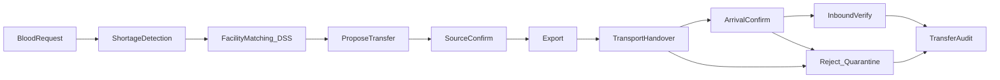

# Product.md — Tài liệu yêu cầu sản phẩm (PRD)

**Tên sản phẩm:** Hệ thống DSS điều phối máu giữa bệnh viện và ngân hàng máu  
**Phiên bản tài liệu:** 2.3  
**Ngôn ngữ:** Tiếng Việt  
**Tham chiếu kỹ thuật:** [README.md](README.md) · [docs/thiet-ke-he-thong.md](docs/thiet-ke-he-thong.md) · [docs/ke-hoach-chinh-sua.md](docs/ke-hoach-chinh-sua.md) · [docs/can-cu-phap-ly.md](docs/can-cu-phap-ly.md) · [AGENTS.md](AGENTS.md) · [`.cursor/rules/ui-ux-design.mdc`](.cursor/rules/ui-ux-design.mdc)

---

## 1. Tổng quan sản phẩm (Overview)

### 1.1. Tầm nhìn

Xây dựng lớp **hỗ trợ quyết định (Decision Support System)** dựa trên dữ liệu, giúp nhân viên bệnh viện và ngân hàng máu phát hiện nguy cơ thiếu máu theo **nhóm máu – địa điểm – thời gian**, xếp hạng **cơ sở nguồn** (bệnh viện / ngân hàng máu) có dư tồn để **đề xuất** điều chuyển, đồng thời hỗ trợ theo dõi **giao nhận** (xác nhận → xuất → vận chuyển → đối chiếu nhập → audit) theo tinh thần Thông tư 26/2013/TT-BYT.

### 1.2. Vấn đề cần giải quyết

1. Nguy cơ **thiếu máu cục bộ** tại bệnh viện theo nhóm máu và thời điểm.
2. Khó **tìm cơ sở nguồn** (NHM hoặc BV khác) có dư tồn phù hợp để điều chuyển.
3. Nhu cầu, tồn kho và điều chuyển thường **phân mảnh**, thiếu vòng khép kín từ phát hiện đến fulfill **có bước xác nhận / đối chiếu**.

### 1.3. Vòng nghiệp vụ lõi

```text
Nhu cầu (BV) → Phân tích tồn kho → Shortage / Coverage
  → Matching cơ sở nguồn (DSS) → Đề xuất điều chuyển
  → Nguồn xác nhận → Xuất kho → Bàn giao vận chuyển (checklist)
  → Đích xác nhận đã nhận hàng → Đối chiếu nhập kho đích
  → qty_fulfilled + audit → Đóng / giảm alert
  (Đích từ chối → đơn vị về nguồn trạng thái cách ly → nguồn xét duyệt)
```

### 1.4. Phạm vi

| Giai đoạn | Nội dung |
| --- | --- |
| **MVP** | Auth/RBAC (3 role), cơ sở BV/NHM + cờ cung cấp, tồn kho, nhu cầu, shortage/coverage, matching cơ sở + log, **lifecycle điều chuyển** (đề xuất→xác nhận→xuất→VC checklist→nhập đối chiếu→audit), cảnh báo, thông báo nội bộ, dashboard/báo cáo |
| **Giai đoạn sau** | Map chi tiết Phụ lục 8 TT 26; dự báo nhu cầu khi đủ lịch sử; tối ưu trọng số matching; sync NHM quốc gia; IoT cold chain |

### 1.5. Ngoài phạm vi

- Không thay thế HIS / LIS bệnh viện đầy đủ.
- Không tuyên bố thuật toán là quyết định y tế chính thức.
- Không thay hợp đồng cung cấp máu hay thẩm quyền cấp phép của cơ quan quản lý.
- Không tự động điều chuyển máu “có hiệu lực pháp lý” chỉ bằng điểm matching.
- Prototype dùng dữ liệu synthetic và ghi rõ nguồn.

### 1.6. Căn cứ & giới hạn pháp lý (tóm tắt)

Chi tiết: [docs/can-cu-phap-ly.md](docs/can-cu-phap-ly.md).

| Văn bản | Vai trò MVP |
| --- | --- |
| **TT 26/2013/TT-BYT** (Điều 39, 20, 40, 61…) | Xương sống quy trình giao nhận / VC / nhập kho / hồ sơ |
| TT 15/2023, Luật KCB 2023 | Không thay quy trình điều phối kho |

**Không có** “Luật hiến máu nhân đạo” riêng cho điều phối liên BV — không viết như thể luật đó đã tồn tại.

**Tách lớp:**

| Lớp | Ví dụ | Gắn “theo BYT”? |
| --- | --- | --- |
| Tuân thủ quy trình | Lifecycle giao nhận, checklist VC/nhập, audit, `allowed_to_supply_others` | Ánh xạ *tinh thần* Điều 39/20/40/61 — cấu hình, không mô phỏng cấp phép |
| Thuật toán DSS | Shortage, Coverage, Score B/D/T/A/R | **Không** — heuristic nghiên cứu / cấu hình nhóm |

---

## 2. Đối tượng người dùng (Personas)

| Người dùng | Nhu cầu chính | Ứng dụng | Quyền / chức năng tiêu biểu |
| --- | --- | --- | --- |
| Nhân viên bệnh viện (`staff_hospital`) | Tạo / hủy nhu cầu của BV mình; nhận hàng và đối chiếu nhập tại BV đích; từ chối khi không đạt | Web Admin (`admin-web`) | Nhu cầu cố định theo cơ sở tài khoản; chỉ xem kho cơ sở mình; khi BV mình là **nguồn** (BV↔BV) thực hiện bước nguồn như NV kho |
| Nhân viên ngân hàng máu (`staff_bank`) | Kho nguồn: nhập đơn vị mới, xuất sử dụng / hủy, xác nhận, xuất điều chuyển, bàn giao VC, xét duyệt cách ly | Web Admin | Đề xuất điều chuyển **chỉ từ tồn kho cơ sở mình** |
| Quản trị / điều phối (`admin`) | Điều phối mạng, chạy matching, đề xuất | Web Admin | Matching, mọi bước lifecycle (thay mặt cơ sở), users, cấu hình cơ sở, nhật ký thao tác; trên **prototype** có thể xác nhận ủy quyền khi chưa có HĐ — **không** tuyên bố = thẩm quyền lãnh đạo pháp lý thật |

Mọi tài khoản nhân viên **bắt buộc** gắn một cơ sở hợp lệ. Admin không thể tự khóa hoặc tự hạ quyền.

---

## 3. Yêu cầu chức năng (Features & Requirements)

| Mã | Chức năng | Mô tả | Ưu tiên MVP |
| --- | --- | --- | --- |
| FR01 | Quản lý tài khoản | Đăng nhập, xác thực, RBAC | Có |
| FR03′ | Quản lý cơ sở | BV / NHM: địa điểm, loại, toạ độ, **`allowed_to_supply_others`**, `has_supply_contract` (cấu hình) | Có |
| FR06 | Quản lý tồn kho | Đơn vị máu, nhóm máu, chế phẩm, hạn dùng, trạng thái. **Nhập** = chỉ đơn vị **mới** (barcode duy nhất, còn hạn) tại cơ sở mình. **Xuất** = cấp phát sử dụng / hủy bỏ / hết hạn, chỉ với đơn vị sẵn sàng, bắt buộc ghi chú. Lịch sử giao dịch theo đơn vị. Đơn vị quá hạn tự chuyển `expired`. Xét duyệt **cách ly** (giải phóng / hủy bỏ kèm lý do) | Có |
| FR06b | Điều chuyển (lifecycle) | Đề xuất → nguồn xác nhận → xuất → bàn giao VC (checklist) → đích xác nhận đã nhận hàng → đối chiếu nhập → `received`; từ chối (đích) → đơn vị cách ly tại nguồn; hủy chỉ trước xuất; audit events có tên người thao tác; bắt buộc gắn `blood_request_id` | Có |
| FR07 | Quản lý nhu cầu | Yêu cầu theo nhóm máu, chế phẩm, số lượng, khoa, BV nhận (cố định theo tài khoản BV), hạn tương lai, ưu tiên. Hủy nhu cầu kèm lý do khi không còn điều chuyển mở. `qty_fulfilled` **chỉ** tăng khi điều chuyển `received` | Có |
| FR08 | Matching cơ sở | Lọc nguồn được phép cung cấp, đúng nhóm máu + chế phẩm, còn hạn, chưa thuộc điều chuyển mở; tính điểm, xếp hạng Top-K; MatchingLog | Có |
| FR13 | Nhật ký thao tác | Audit log thao tác nhạy cảm: xem kho, xem báo cáo, chạy matching, nhập/xuất kho, xét duyệt cách ly, tạo/hủy nhu cầu, đổi cấu hình cơ sở, quản lý user. Chỉ admin xem | Có |
| FR09 | Cảnh báo | Thiếu hụt, tồn thấp, hết hạn theo cấu hình | Có |
| FR10 | Phân tích / dự báo | Thống kê lịch sử; dự báo nếu đủ dữ liệu | Thống kê: Có · Dự báo: Sau MVP |
| FR11 | Thông báo nội bộ | Thông báo staff về đề xuất / bước transfer / hoàn thành | Có |
| FR12 | Báo cáo | Tồn kho, nhu cầu, transfer, hiệu quả điều phối | Có |

---

## 4. Luồng người dùng (User flows)

### 4.1. Bệnh viện: tạo nhu cầu → theo dõi fulfill

1. `staff_hospital` đăng nhập (FR01).
2. Tạo **nhu cầu máu** cho BV mình (FR07).
3. Hệ thống tính Shortage / Coverage → tạo alert nếu thiếu (FR09).
4. Theo dõi lifecycle điều chuyển tới BV. Khi hàng tới: **Đã nhận hàng** (`in_transit → inbound_pending`), rồi **Đối chiếu nhập** (`→ received`) hoặc **Từ chối** (`→ rejected`) (FR06b, FR11).

### 4.2. Điều phối: nhu cầu → matching → lifecycle giao nhận

1. Admin / điều phối xem nhu cầu mở và alerts (FR07, FR09).
2. Chạy **matching cơ sở** (FR08) → Top-K kèm điểm thành phần; ghi MatchingLog. Chỉ đề xuất — không fulfill.
3. Tạo điều chuyển trạng thái `proposed` gắn `blood_request_id` + đơn vị (FR06b). Nếu `has_supply_contract = false`: bắt buộc xác nhận lãnh đạo/ủy quyền **kèm lý do**; hệ thống lưu người, thời điểm, lý do.
4. Nguồn (`staff_bank` / staff cơ sở nguồn / admin) **xác nhận** → unit `reserved`.
5. **Xuất kho** → `exported`, unit `transferred`.
6. **Bàn giao vận chuyển** + checklist Điều 20 (dải nhiệt khóa theo chế phẩm, nhiệt độ đo tùy chọn trong dải, đá không tiếp xúc, phương tiện, tên người VC) → `in_transit`.
7. Đích **xác nhận đã nhận hàng** → `inbound_pending`.
8. Đích **đối chiếu nhập** (Điều 40) → `received`; hoặc **từ chối** → `rejected`, đơn vị về nguồn trạng thái `quarantine`.
9. Khi `received`: tăng `qty_fulfilled`, unit `ready` tại đích, refresh alerts, thông báo (FR11).

### 4.3. Nhân viên kho: nhập/xuất → cảnh báo hạn / tồn thấp

1. Nhập đơn vị máu **mới** (FR06) — không dùng để nhận đơn vị từ cơ sở khác (chỉ qua điều chuyển).
2. Xuất cấp phát / hủy bỏ / hết hạn kèm ghi chú (FR06).
3. Tham gia bước xác nhận / xuất / bàn giao VC trên transfer (FR06b).
4. Xét duyệt đơn vị **cách ly** sau khi bị từ chối (FR06).
5. Cảnh báo gần hết hạn hoặc tồn dưới ngưỡng (FR09).
6. Báo cáo tồn kho / tỷ lệ hết hạn – hủy bỏ (FR12).



### 4.4. Đặc tả use case

Quy ước chung cho mọi use case:

- Mỗi bước là **một thao tác của con người**, có ConfirmModal (tóm tắt + ô xác nhận; **không** xác nhận bằng Enter). Mọi chuyển trạng thái điều chuyển ghi `transfer_events` (người, thời điểm, ghi chú).
- Màn hình chi tiết điều chuyển `/transfers/:id` chỉ hiển thị **một CTA chính** đúng vai trò và trạng thái; bên không phải thao tác thấy dòng "Đang chờ …".
- Lý do (hủy, từ chối, lãnh đạo, cách ly) tối thiểu 3 ký tự.
- DSS chỉ hỗ trợ quyết định — không thay chỉ định lâm sàng, hợp đồng hay thẩm quyền pháp lý.

#### UC01 — Tạo nhu cầu cấp máu

| Mục | Nội dung |
| --- | --- |
| Tác nhân | `staff_hospital` (cơ sở cố định theo tài khoản); `admin` (chọn cơ sở) |
| Tiền điều kiện | Đã đăng nhập; tài khoản BV gắn cơ sở |
| Luồng chính | Nhu cầu → **Tạo nhu cầu cấp máu** → nhập khoa, nhóm máu (8 nhóm), chế phẩm, số lượng (1–500), ưu tiên, hạn → **Tiếp tục…** → ConfirmModal → **Tạo nhu cầu** |
| Luồng thay thế | Hạn không ở tương lai / nhóm máu, chế phẩm sai → lỗi inline, không gửi. Hủy trên ConfirmModal → quay lại form với dữ liệu giữ nguyên |
| Hậu điều kiện | Nhu cầu `open`, `qty_fulfilled = 0`; alerts được làm mới; audit `demand.create` |

#### UC02 — Chạy matching và đề xuất điều chuyển

| Mục | Nội dung |
| --- | --- |
| Tác nhân | `admin` (màn Matching); API cũng cho `staff_bank` đề xuất từ tồn kho cơ sở mình |
| Tiền điều kiện | Nhu cầu `open` / `matching` |
| Luồng chính | Matching → chọn nhu cầu → **Chạy matching** → Top-K cơ sở với điểm thành phần → **Xem xét đề xuất** → chọn đơn vị (chỉ đơn vị đúng nhóm + chế phẩm, còn hạn, chưa thuộc điều chuyển mở) → ConfirmModal → tạo `proposed` → mở `/transfers/:id` |
| Luồng thay thế | Nguồn chưa có HĐ → bắt buộc tick xác nhận lãnh đạo/ủy quyền + lý do. Nguồn không `allowed_to_supply_others` → không xuất hiện / bị chặn. Số đơn vị đang mở + đã nhận ≥ số cần → chặn. Đơn vị đã thuộc điều chuyển mở → 409 |
| Hậu điều kiện | Transfer `proposed`; nhu cầu `matching`; thông báo cơ sở đích và nguồn; audit `matching.run`; `qty_fulfilled` không đổi |

#### UC03 — Nguồn xác nhận

| Mục | Nội dung |
| --- | --- |
| Tác nhân | NV cơ sở nguồn; `admin` |
| Tiền điều kiện | Transfer `proposed`; đơn vị sẵn sàng, còn hạn, tại nguồn; nguồn vẫn `allowed_to_supply_others` |
| Luồng chính | Chi tiết điều chuyển → **Xác nhận nguồn** → ConfirmModal |
| Luồng thay thế | Không HĐ và chưa có xác nhận lãnh đạo → bắt buộc lý do lãnh đạo tại bước này. Đơn vị hết hạn → chặn |
| Hậu điều kiện | `source_confirmed`; đơn vị `reserved` |

#### UC04 — Xuất kho theo điều chuyển

| Mục | Nội dung |
| --- | --- |
| Tác nhân | NV cơ sở nguồn; `admin` |
| Tiền điều kiện | `source_confirmed`; đơn vị `reserved` tại nguồn, còn hạn |
| Luồng chính | **Xuất kho** → ConfirmModal |
| Hậu điều kiện | `exported`; đơn vị `transferred`; giao dịch `out` lý do `transfer_out` |

#### UC05 — Bàn giao vận chuyển (tinh thần Điều 20)

| Mục | Nội dung |
| --- | --- |
| Tác nhân | NV cơ sở nguồn; `admin` |
| Tiền điều kiện | `exported` |
| Luồng chính | Form bàn giao: dải nhiệt **chỉ đọc** theo chế phẩm (HC / máu toàn phần 1–10°C; tiểu cầu / bạch cầu 20–24°C; huyết tương / tủa ≤ −18°C), nhiệt độ đo (tùy chọn), tên người vận chuyển, tick đá không tiếp xúc trực tiếp + phương tiện phù hợp → ConfirmModal |
| Luồng thay thế | Dải nhiệt khác yêu cầu hoặc nhiệt độ đo ngoài dải → backend từ chối, không bàn giao |
| Hậu điều kiện | `in_transit` (**không** tự chuyển sang chờ đối chiếu); lưu checklist, người bàn giao, người VC; thông báo đích |

#### UC06 — Xác nhận đã nhận hàng

| Mục | Nội dung |
| --- | --- |
| Tác nhân | NV cơ sở đích; `admin` |
| Tiền điều kiện | `in_transit` |
| Luồng chính | **Đã nhận hàng** → ConfirmModal |
| Hậu điều kiện | `inbound_pending`; lưu `arrived_at` |

#### UC07 — Đối chiếu nhập kho đích (tinh thần Điều 40)

| Mục | Nội dung |
| --- | --- |
| Tác nhân | NV cơ sở đích; `admin` |
| Tiền điều kiện | `inbound_pending`; đơn vị còn hạn |
| Luồng chính | Tick bao gói đạt, nhãn khớp, điều kiện VC đạt; ghi chú bất thường (tùy chọn) → ConfirmModal → **Nhập kho** |
| Luồng thay thế | Thiếu mục tick → không cho nhập. Đơn vị hết hạn → không nhập, dùng UC08. Có ghi chú bất thường → thông báo cả hai cơ sở |
| Hậu điều kiện | `received`; đơn vị `ready` tại đích; giao dịch `transfer_in`; `qty_fulfilled + 1` (nhu cầu `fulfilled` khi đủ); alerts làm mới |

#### UC08 — Từ chối nhận

| Mục | Nội dung |
| --- | --- |
| Tác nhân | NV cơ sở đích; `admin` (nguồn **không** được từ chối) |
| Tiền điều kiện | `in_transit` hoặc `inbound_pending` |
| Luồng chính | **Từ chối…** → đánh dấu mục không đạt + ghi chú → ConfirmModal bắt buộc lý do |
| Hậu điều kiện | `rejected`; đơn vị về nguồn trạng thái `quarantine` (giao dịch `return_quarantine`); thông báo nguồn; `qty_fulfilled` không đổi |

#### UC09 — Hủy điều chuyển

| Mục | Nội dung |
| --- | --- |
| Tác nhân | NV cơ sở nguồn; `admin` |
| Tiền điều kiện | **Chỉ** `proposed` hoặc `source_confirmed` (sau xuất kho không hủy được — đích dùng UC08) |
| Luồng chính | **Hủy điều chuyển…** → ConfirmModal bắt buộc lý do |
| Hậu điều kiện | `cancelled`; đơn vị `reserved` về `ready` (hoặc `expired` nếu đã quá hạn) |

#### UC10 — Xét duyệt đơn vị cách ly

| Mục | Nội dung |
| --- | --- |
| Tác nhân | NV cơ sở đang giữ đơn vị (nguồn); `admin` |
| Tiền điều kiện | Đơn vị `quarantine` |
| Luồng chính | Kho → **Xét duyệt cách ly…** → chọn Giải phóng hoặc Hủy bỏ + lý do → ConfirmModal |
| Luồng thay thế | Đơn vị đã hết hạn → chỉ được Hủy bỏ |
| Hậu điều kiện | `ready` hoặc `discarded` (giao dịch `out` lý do `discarded`); audit `inventory.quarantine_review` |

#### UC11 — Nhập đơn vị máu mới

| Mục | Nội dung |
| --- | --- |
| Tác nhân | `staff_bank` (cơ sở mình); `admin` (chọn cơ sở) |
| Luồng chính | Kho → **Nhập đơn vị mới** → barcode, nhóm máu, chế phẩm, thể tích, ngày lấy, hạn dùng, vị trí → ConfirmModal |
| Luồng thay thế | Barcode đã tồn tại → 409 (đơn vị từ cơ sở khác phải qua điều chuyển). Hết hạn / ngày lấy sau hạn → chặn |
| Hậu điều kiện | Đơn vị `ready`; giao dịch `in` lý do `receipt`; audit `inventory.receive` |

#### UC12 — Xuất sử dụng / hủy bỏ / hết hạn

| Mục | Nội dung |
| --- | --- |
| Tác nhân | `staff_bank` (cơ sở mình); `admin` |
| Tiền điều kiện | Đơn vị `ready` / `critical` (hoặc `expired` khi lý do = hết hạn) |
| Luồng chính | Kho → **Xuất…** → lý do (cấp phát sử dụng / hủy bỏ / hết hạn) + ghi chú → ConfirmModal |
| Luồng thay thế | Đơn vị hết hạn → không được "cấp phát sử dụng". Đơn vị đang giữ chỗ / điều chuyển / cách ly → chặn |
| Hậu điều kiện | `used` / `discarded` / `expired`; giao dịch `out`; audit `inventory.out` |

#### UC13 — Hủy nhu cầu

| Mục | Nội dung |
| --- | --- |
| Tác nhân | `staff_hospital` (nhu cầu cơ sở mình); `admin` |
| Tiền điều kiện | Nhu cầu `open` / `matching`; **không** còn điều chuyển mở |
| Luồng chính | Nhu cầu → **Hủy…** → ConfirmModal bắt buộc lý do |
| Hậu điều kiện | `cancelled` + `cancel_reason`; alerts đóng; audit `demand.cancel` |

---

## 5. Logic nghiệp vụ cốt lõi

> Các công thức dưới đây là **heuristic nghiên cứu / cấu hình** — **không** phải quy định BYT. Semantics và trọng số chỉ được copy từ mục này; thiếu thì hỏi nghiệp vụ.

### 5.1. Phát hiện thiếu hụt

\[
\text{Shortage}(g,t,l) = \text{Demand}(g,t,l) - \text{Inventory}(g,t,l)
\]

### 5.2. Độ phủ tồn kho

\[
\text{Coverage} = \frac{\text{Inventory}}{\text{Expected Demand}}
\]

Ngưỡng cảnh báo do cấu hình — **không** phải ngưỡng y tế chính thức.

### 5.3. Matching score cơ sở (prototype)

\[
\text{Score} = w_1 B + w_2 D + w_3 T + w_4 A + w_5 R
\]

| Ký hiệu | Ý nghĩa |
| --- | --- |
| \(B\) | Đủ đơn vị đúng nhóm máu tại nguồn |
| \(D\) | Khoảng cách nguồn → BV nhận (Haversine) |
| \(T\) | Hạn dùng vs deadline nhu cầu |
| \(A\) | Mức dư so với ngưỡng an toàn tại nguồn (**cấu hình nhóm** — chưa xác nhận nghiệp vụ) |
| \(R\) | Tỷ lệ hoàn thành điều chuyển lịch sử |
| \(w_i\) | Trọng số cấu hình (prototype mặc định 0.35/0.25/0.15/0.15/0.10) |

Nguồn ứng viên phải có `allowed_to_supply_others = true`. Kết quả Top-K phải **giải thích được**; lưu MatchingLog. Matching **không** thay quyết định cấp phát lâm sàng (tinh thần Điều 38).

### 5.4. Dự báo nhu cầu (giai đoạn sau)

Baseline Moving Average / Exponential Smoothing trước ML.

### 5.5. Trạng thái BloodTransfer (MVP)

`proposed` → `source_confirmed` → `exported` → `in_transit` → `inbound_pending` → `received` \| `rejected` \| `cancelled`

| Chuyển | Ai thực hiện |
| --- | --- |
| tạo `proposed` | admin; `staff_bank` (chỉ từ cơ sở mình) |
| `proposed → source_confirmed`, `→ exported`, `→ in_transit` | NV cơ sở nguồn; admin |
| `in_transit → inbound_pending`, `inbound_pending → received` | NV cơ sở đích; admin |
| `in_transit` \| `inbound_pending` `→ rejected` | NV cơ sở đích; admin — đơn vị về nguồn `quarantine` |
| `proposed` \| `source_confirmed` `→ cancelled` | NV cơ sở nguồn; admin |

### 5.6. Quy tắc an toàn đơn vị (cấu hình hệ thống — không phải chỉ định lâm sàng)

- **Khớp chặt:** đơn vị đề xuất phải trùng **nhóm ABO/Rh** và **chế phẩm** của nhu cầu. Truyền thay thế là quyết định lâm sàng ngoài hệ thống.
- **Còn hạn ở mọi bước:** đề xuất, xác nhận, xuất, nhận đều kiểm tra hạn; đơn vị quá hạn đang sẵn sàng tự chuyển `expired`.
- **Không vượt số lượng:** số điều chuyển đang mở + đã nhận không vượt `qty_needed`.
- **Một đơn vị – một điều chuyển mở.**
- **Đơn vị bị từ chối không quay lại tồn sẵn sàng** cho đến khi nguồn xét duyệt cách ly.

### 5.7. Trạng thái đơn vị máu

`ready` · `critical` (sẵn sàng, gần hết hạn) · `reserved` · `transferred` · `used` · `expired` · `quarantine` · `discarded`. Đơn vị khả dụng cho matching / xuất = `ready` hoặc `critical` và còn hạn.

### 5.8. Mức Coverage trên giao diện

Màu ma trận tồn kho / thẻ nhóm máu dùng Coverage §5.2 so với ngưỡng cấu hình `COVERAGE_WARN` / `COVERAGE_CRITICAL` (backend `/inventory/coverage`): dưới ngưỡng nghiêm trọng / dưới ngưỡng cảnh báo / đạt / không có nhu cầu mở. Ngưỡng là cấu hình prototype — không phải ngưỡng y tế.

---

## 6. Mô hình dữ liệu (thực thể lõi)

| Thực thể | Mục đích |
| --- | --- |
| User / Role | Tài khoản RBAC (`staff_hospital`, `staff_bank`, `admin`) |
| DonationCenter (Facility) | Cơ sở `hospital` \| `bank`; `allowed_to_supply_others`; `has_supply_contract` |
| BloodUnit | Đơn vị máu / chế phẩm (trạng thái §5.7) |
| InventoryTransaction | `in` / `out` + `reason` (`receipt`, `issued`, `discarded`, `expired`, `transfer_out`, `transfer_in`, `return_quarantine`); gắn `transfer_id` khi thuộc lifecycle |
| BloodRequest | Nhu cầu máu của BV; `created_by`, `cancel_reason` |
| BloodTransfer | Điều chuyển đa bước + checklist VC / nhập; người xác nhận lãnh đạo + thời điểm + lý do; người bàn giao, người VC, thời điểm tới, người nhận |
| TransferEvent | Audit chuyển trạng thái (tinh thần Điều 61) |
| AuditLog | Nhật ký thao tác nhạy cảm ngoài lifecycle (FR13) |
| Alert | Cảnh báo shortage / hạn / tồn thấp |
| Notification | Thông báo nội bộ staff |
| MatchingLog | Audit chạy matching Top-K cơ sở |

---

## 7. Yêu cầu phi chức năng

| Nhóm | Yêu cầu |
| --- | --- |
| Hiệu năng | Matching / tra cứu phù hợp quy mô prototype |
| Bảo mật | JWT, RBAC, không lộ service role |
| Riêng tư | Thu thập tối thiểu; hạn chế theo vai trò |
| Tin cậy | Tồn kho và fulfill nhất quán theo lifecycle |
| Minh bạch | Matching giải thích được; không phải quyết định y tế / pháp lý |
| Audit | Lưu sự kiện giao nhận (`transfer_events`) và thao tác nhạy cảm (`audit_logs`) trên hệ thống prototype |
| Kiểm thử | Bộ pytest lifecycle / RBAC / quy tắc an toàn phải xanh trước khi demo (`backend/tests`) |

---

## 8. KPI và tiêu chí đánh giá

| Nhóm | KPI | Ý nghĩa |
| --- | --- | --- |
| Matching | Precision@K | Chất lượng Top-K cơ sở |
| Điều phối | Tỷ lệ fulfill nhu cầu | Hiệu quả transfer (sau `received`) |
| Kho | Shortage Rate | Mức độ thiếu hụt |
| Kho | Wastage / Expiry Rate | Lãng phí / hết hạn |
| Hệ thống | Response Time | Tốc độ API / UI |

---

## 9. Ghi chú thiết kế và API

### 9.1. Kiến trúc kỹ thuật

| Lớp | Công nghệ |
| --- | --- |
| Web Admin | React + Vite + Bootstrap (`admin-web`) |
| API nghiệp vụ | Python FastAPI (`backend`) |
| Dữ liệu | Supabase PostgreSQL / SQLite local |

- Client chỉ gọi REST FastAPI (JWT + RBAC).
- Matching / shortage / transfer lifecycle ở backend service, có log.

### 9.2. Ràng buộc thiết kế UI

- Admin: bảng, form, dashboard cảnh báo và KPI (Bootstrap).
- Matching: kèm điểm thành phần — không như chỉ định y tế bắt buộc; **Xem xét đề xuất** chọn đơn vị hợp lệ + xác nhận lãnh đạo kèm lý do (khi không HĐ) trước khi tạo `proposed`.
- Transfer: danh sách `/transfers` (lọc "Cần tôi xử lý") + chi tiết `/transfers/:id` với **một CTA** theo role và status; disclaimer DSS cố định; **không** gộp bước lifecycle; mọi chuyển trạng thái qua **ConfirmModal** (tóm tắt + Hủy/Xác nhận, không Enter-to-confirm).
- Checklist VC (Điều 20) / nhập (Điều 40): giữ tick sẵn (quyết định P2c) + ConfirmModal với câu xác nhận đã đối chiếu thực tế; bỏ tick mục nào thì backend chặn bước đó. Dải nhiệt chỉ đọc theo chế phẩm; tên người VC bắt buộc.
- Mỗi trang có trạng thái đang tải / lỗi (Thử lại) / rỗng; nhãn tiếng Việt thống nhất cho mọi trạng thái; màu đỏ chỉ dùng cho nguy hiểm.
- Trang đăng nhập không điền sẵn thông tin tài khoản.
- Thao tác nhạy cảm khác (cờ cơ sở, user, thông báo, tạo nhu cầu): ConfirmModal. Thao tác nhỏ reversible (vd. đánh dấu cảnh báo): toast Undo.
- OTP / ký số: ngoài MVP — hook production (xem can-cu-phap-ly §5b).
- Chi tiết: [docs/ke-hoach-chinh-sua.md](docs/ke-hoach-chinh-sua.md) · [`.cursor/rules/ui-ux-design.mdc`](.cursor/rules/ui-ux-design.mdc).

### 9.3. Câu hỏi nghiên cứu

- **RQ1:** Phát hiện thiếu máu theo nhóm máu, khu vực, thời gian?
- **RQ2:** Xếp hạng cơ sở nguồn theo tồn dư, khoảng cách, hạn dùng, an toàn kho?
- **RQ3:** Phương pháp dự báo nào phù hợp so với baseline?
- **RQ4:** Shortage + facility matching có cải thiện fulfill so với chọn nguồn thủ công?

### 9.4. Câu hỏi nghiệp vụ còn mở (không tự đặt)

Xem [docs/can-cu-phap-ly.md](docs/can-cu-phap-ly.md) §6 — ngưỡng A, người xác nhận lãnh đạo production, bắt buộc HĐ, ưu tiên BV←NHM vs BV↔BV, map Phụ lục 8.

---

## 10. Lịch sử thay đổi tài liệu

| Phiên bản | Ngày | Mô tả |
| --- | --- | --- |
| 1.0–1.2 | 2026-09-15…17 | PRD khởi tạo + MVP admin scaffold |
| 2.0 | 2026-09-17 | Pivot: DSS điều phối BV ↔ ngân hàng máu |
| 2.1 | 2026-09-24 | TT 26-min: căn cứ pháp lý; lifecycle giao nhận; tách DSS vs quy trình; FR06b |
| 2.2 | 2026-09-24 | P2c UX Confirm: ConfirmModal / Review / Undo / validate — không rút lifecycle |
| 2.3 | 2026-10-06 | P2d tuân thủ nghiêm ngặt: tách bàn giao VC / đã nhận hàng; từ chối → cách ly + xét duyệt; hủy chỉ trước xuất; khớp chặt nhóm + chế phẩm, còn hạn mọi bước, giới hạn số lượng, một đơn vị một điều chuyển; khóa dải nhiệt theo chế phẩm; lý do lãnh đạo; nhập kho chỉ đơn vị mới; audit log (FR13); đặc tả UC01–UC13 |
