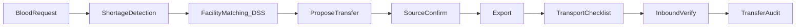

# Product.md — Tài liệu yêu cầu sản phẩm (PRD)

**Tên sản phẩm:** Hệ thống DSS điều phối máu giữa bệnh viện và ngân hàng máu  
**Phiên bản tài liệu:** 2.1  
**Ngôn ngữ:** Tiếng Việt  
**Tham chiếu kỹ thuật:** [README.md](README.md) · [docs/thiet-ke-he-thong.md](docs/thiet-ke-he-thong.md) · [docs/ke-hoach-chinh-sua.md](docs/ke-hoach-chinh-sua.md) · [docs/can-cu-phap-ly.md](docs/can-cu-phap-ly.md) · [AGENTS.md](AGENTS.md) · [`.cursor/rules/ui-ux-design.mdc`](.cursor/rules/ui-ux-design.mdc)

---

## 1. Tổng quan sản phẩm (Overview)

### 1.1. Tầm nhìn

Xây dựng lớp **hỗ trợ quyết định (Decision Support System)** dựa trên dữ liệu, giúp nhân viên bệnh viện và ngân hàng máu phát hiện nguy cơ thiếu máu theo **nhóm máu – địa điểm – thời gian**, xếp hạng **cơ sở nguồn** (bệnh viện / ngân hàng máu) có dư tồn để **đề xuất** điều chuyển, đồng thời hỗ trợ theo dõi **giao nhận** (xác nhận → xuất → vận chuyển → đối chiếu nhập → audit) theo tinh thần Thông tư 26/2013/TT-BYT.

Sản phẩm **không** định vị là ứng dụng kết nối / huy động người hiến máu.

### 1.2. Vấn đề cần giải quyết

1. Nguy cơ **thiếu máu cục bộ** tại bệnh viện theo nhóm máu và thời điểm.
2. Khó **tìm cơ sở nguồn** (NHM hoặc BV khác) có dư tồn phù hợp để điều chuyển.
3. Nhu cầu, tồn kho và điều chuyển thường **phân mảnh**, thiếu vòng khép kín từ phát hiện đến fulfill **có bước xác nhận / đối chiếu**.

### 1.3. Vòng nghiệp vụ lõi

```text
Nhu cầu (BV) → Phân tích tồn kho → Shortage / Coverage
  → Matching cơ sở nguồn (DSS) → Đề xuất điều chuyển
  → Nguồn xác nhận → Xuất kho → Vận chuyển (checklist)
  → Đối chiếu nhập kho đích → qty_fulfilled + audit → Đóng / giảm alert
```

### 1.4. Phạm vi

| Giai đoạn | Nội dung |
| --- | --- |
| **MVP** | Auth/RBAC (3 role), cơ sở BV/NHM + cờ cung cấp, tồn kho, nhu cầu, shortage/coverage, matching cơ sở + log, **lifecycle điều chuyển** (đề xuất→xác nhận→xuất→VC checklist→nhập đối chiếu→audit), cảnh báo, thông báo nội bộ, dashboard/báo cáo |
| **Giai đoạn sau** | Map chi tiết Phụ lục 8 TT 26; dự báo nhu cầu khi đủ lịch sử; tối ưu trọng số matching; sync NHM quốc gia; IoT cold chain |

### 1.5. Ngoài phạm vi

- Không thay thế HIS / LIS bệnh viện đầy đủ.
- Không huy động người hiến, đặt lịch hiến, hay app donor.
- Không tuyên bố thuật toán là quyết định y tế chính thức.
- Không thay hợp đồng cung cấp máu hay thẩm quyền cấp phép của cơ quan quản lý.
- Không tự động điều chuyển máu “có hiệu lực pháp lý” chỉ bằng điểm matching.
- Prototype dùng dữ liệu synthetic và ghi rõ nguồn.

### 1.6. Căn cứ & giới hạn pháp lý (tóm tắt)

Chi tiết: [docs/can-cu-phap-ly.md](docs/can-cu-phap-ly.md).

| Văn bản | Vai trò MVP |
| --- | --- |
| **TT 26/2013/TT-BYT** (Điều 39, 20, 40, 61…) | Xương sống quy trình giao nhận / VC / nhập kho / hồ sơ |
| TT 15/2023, Luật KCB 2023 | Không thay quy trình điều phối kho |
| TT 04/2014, QĐ 43/2000, CTĐ… | Ngoài trọng tâm MVP (không module hiến) |

**Không có** “Luật hiến máu nhân đạo” riêng cho điều phối liên BV — không viết như thể luật đó đã tồn tại.

**Tách lớp:**

| Lớp | Ví dụ | Gắn “theo BYT”? |
| --- | --- | --- |
| Tuân thủ quy trình | Lifecycle giao nhận, checklist VC/nhập, audit, `allowed_to_supply_others` | Ánh xạ *tinh thần* Điều 39/20/40/61 — cấu hình, không mô phỏng cấp phép |
| Thuật toán DSS | Shortage, Coverage, Score B/D/T/A/R | **Không** — heuristic nghiên cứu / cấu hình nhóm |

---

## 2. Đối tượng người dùng (Personas)

| Người dùng | Nhu cầu chính | Ứng dụng | Quyền / chức năng tiêu biểu |
| --- | --- | --- | --- |
| Nhân viên bệnh viện (`staff_hospital`) | Tạo nhu cầu, đối chiếu nhập tại BV đích | Web Admin (`admin-web`) | Nhu cầu scoped BV, alerts, inbound verify |
| Nhân viên ngân hàng máu (`staff_bank`) | Kho nguồn: xác nhận, xuất, checklist VC | Web Admin | Confirm / export / transit, cảnh báo kho |
| Quản trị / điều phối (`admin`) | Điều phối mạng, đề xuất từ matching | Web Admin | Matching, giám sát transfer, users, báo cáo; trên **prototype** có thể xác nhận ủy quyền khi chưa có HĐ — **không** tuyên bố = thẩm quyền lãnh đạo pháp lý thật |

---

## 3. Yêu cầu chức năng (Features & Requirements)

| Mã | Chức năng | Mô tả | Ưu tiên MVP |
| --- | --- | --- | --- |
| FR01 | Quản lý tài khoản | Đăng nhập, xác thực, RBAC | Có |
| FR03′ | Quản lý cơ sở | BV / NHM: địa điểm, loại, toạ độ, **`allowed_to_supply_others`**, `has_supply_contract` (cấu hình) | Có |
| FR06 | Quản lý tồn kho | Đơn vị máu, nhóm máu, chế phẩm, hạn dùng, trạng thái, giao dịch `in`/`out` | Có |
| FR06b | Điều chuyển (lifecycle) | Đề xuất → nguồn xác nhận → xuất → VC checklist → đối chiếu nhập → received/rejected; audit events; gắn `blood_request_id` | Có |
| FR07 | Quản lý nhu cầu | Yêu cầu theo nhóm máu, số lượng, BV nhận, thời gian, ưu tiên | Có |
| FR08 | Matching cơ sở | Lọc nguồn được phép cung cấp, tính điểm, xếp hạng Top-K; MatchingLog | Có |
| FR09 | Cảnh báo | Thiếu hụt, tồn thấp, hết hạn theo cấu hình | Có |
| FR10 | Phân tích / dự báo | Thống kê lịch sử; dự báo nếu đủ dữ liệu | Thống kê: Có · Dự báo: Sau MVP |
| FR11 | Thông báo nội bộ | Thông báo staff về đề xuất / bước transfer / hoàn thành | Có |
| FR12 | Báo cáo | Tồn kho, nhu cầu, transfer, hiệu quả điều phối | Có |

---

## 4. Luồng người dùng (User flows)

### 4.1. Bệnh viện: tạo nhu cầu → theo dõi fulfill

1. `staff_hospital` đăng nhập (FR01).
2. Tạo **nhu cầu máu** cho BV mình (FR07).
3. Hệ thống tính Shortage / Coverage → tạo alert nếu thiếu (FR09).
4. Theo dõi lifecycle điều chuyển tới BV; thực hiện **đối chiếu nhập** khi `inbound_pending` (FR06b, FR11).

### 4.2. Điều phối: nhu cầu → matching → lifecycle giao nhận

1. Admin / điều phối xem nhu cầu mở và alerts (FR07, FR09).
2. Chạy **matching cơ sở** (FR08) → Top-K kèm điểm thành phần; ghi MatchingLog. Chỉ đề xuất — không fulfill.
3. Tạo điều chuyển trạng thái `proposed` gắn `blood_request_id` + đơn vị (FR06b).
4. Nguồn (`staff_bank` / staff cơ sở nguồn) **xác nhận** → unit `reserved`. Nếu `has_supply_contract = false`: cần `leadership_confirmed` (prototype: `admin` hoặc staff nguồn được phép).
5. **Xuất** → `exported`; bắt đầu VC + checklist Điều 20 → `in_transit` / `inbound_pending`.
6. Đích **đối chiếu nhập** (Điều 40) → `received` hoặc `rejected`.
7. Khi `received`: tăng `qty_fulfilled`, unit `ready` tại đích, refresh alerts, thông báo (FR11).

### 4.3. Nhân viên kho: nhập/xuất → cảnh báo hạn / tồn thấp

1. Nhập đơn vị máu mới (FR06) — không nhầm với nhận từ điều chuyển.
2. Tham gia bước xuất / checklist VC trên transfer (FR06b).
3. Cảnh báo gần hết hạn hoặc tồn dưới ngưỡng (FR09).
4. Báo cáo tồn kho / wastage (FR12).



---

## 5. Logic nghiệp vụ cốt lõi

> Các công thức dưới đây là **heuristic nghiên cứu / cấu hình** — **không** phải quy định BYT. Semantics và trọng số chỉ được copy từ mục này; thiếu thì hỏi nghiệp vụ.

### 5.1. Phát hiện thiếu hụt

\[
\text{Shortage}(g,t,l) = \text{Demand}(g,t,l) - \text{Inventory}(g,t,l)
\]

### 5.2. Độ phủ tồn kho

\[
\text{Coverage} = \frac{\text{Inventory}}{\text{Expected Demand}}
\]

Ngưỡng cảnh báo do cấu hình — **không** phải ngưỡng y tế chính thức.

### 5.3. Matching score cơ sở (prototype)

\[
\text{Score} = w_1 B + w_2 D + w_3 T + w_4 A + w_5 R
\]

| Ký hiệu | Ý nghĩa |
| --- | --- |
| \(B\) | Đủ đơn vị đúng nhóm máu tại nguồn |
| \(D\) | Khoảng cách nguồn → BV nhận (Haversine) |
| \(T\) | Hạn dùng vs deadline nhu cầu |
| \(A\) | Mức dư so với ngưỡng an toàn tại nguồn (**cấu hình nhóm** — chưa xác nhận nghiệp vụ) |
| \(R\) | Tỷ lệ hoàn thành điều chuyển lịch sử |
| \(w_i\) | Trọng số cấu hình (prototype mặc định 0.35/0.25/0.15/0.15/0.10) |

Nguồn ứng viên phải có `allowed_to_supply_others = true`. Kết quả Top-K phải **giải thích được**; lưu MatchingLog. Matching **không** thay quyết định cấp phát lâm sàng (tinh thần Điều 38).

### 5.4. Dự báo nhu cầu (giai đoạn sau)

Baseline Moving Average / Exponential Smoothing trước ML.

### 5.5. Trạng thái BloodTransfer (MVP)

`proposed` → `source_confirmed` → `exported` → `in_transit` → `inbound_pending` → `received` \| `rejected` \| `cancelled`

---

## 6. Mô hình dữ liệu (thực thể lõi)

| Thực thể | Mục đích |
| --- | --- |
| User / Role | Tài khoản RBAC (`staff_hospital`, `staff_bank`, `admin`) |
| DonationCenter (Facility) | Cơ sở `hospital` \| `bank`; `allowed_to_supply_others`; `has_supply_contract` |
| BloodUnit | Đơn vị máu / chế phẩm (`ready` / `reserved` / `transferred` / …) |
| InventoryTransaction | `in` / `out` gắn `transfer_id` khi thuộc lifecycle |
| BloodRequest | Nhu cầu máu của BV |
| BloodTransfer | Điều chuyển đa bước + checklist VC / nhập |
| TransferEvent | Audit chuyển trạng thái (tinh thần Điều 61) |
| Alert | Cảnh báo shortage / hạn / tồn thấp |
| Notification | Thông báo nội bộ staff |
| MatchingLog | Audit chạy matching Top-K cơ sở |

---

## 7. Yêu cầu phi chức năng

| Nhóm | Yêu cầu |
| --- | --- |
| Hiệu năng | Matching / tra cứu phù hợp quy mô prototype |
| Bảo mật | JWT, RBAC, không lộ service role |
| Riêng tư | Thu thập tối thiểu; hạn chế theo vai trò |
| Tin cậy | Tồn kho và fulfill nhất quán theo lifecycle |
| Minh bạch | Matching giải thích được; không phải quyết định y tế / pháp lý |
| Audit | Lưu sự kiện giao nhận trên hệ thống prototype |

---

## 8. KPI và tiêu chí đánh giá

| Nhóm | KPI | Ý nghĩa |
| --- | --- | --- |
| Matching | Precision@K | Chất lượng Top-K cơ sở |
| Điều phối | Tỷ lệ fulfill nhu cầu | Hiệu quả transfer (sau `received`) |
| Kho | Shortage Rate | Mức độ thiếu hụt |
| Kho | Wastage / Expiry Rate | Lãng phí / hết hạn |
| Hệ thống | Response Time | Tốc độ API / UI |

---

## 9. Ghi chú thiết kế và API

### 9.1. Kiến trúc kỹ thuật

| Lớp | Công nghệ |
| --- | --- |
| Web Admin | React + Vite + Bootstrap (`admin-web`) |
| API nghiệp vụ | Python FastAPI (`backend`) |
| Dữ liệu | Supabase PostgreSQL / SQLite local |

- Client chỉ gọi REST FastAPI (JWT + RBAC).
- Matching / shortage / transfer lifecycle ở backend service, có log.

### 9.2. Ràng buộc thiết kế UI

- Admin: bảng, form, dashboard cảnh báo và KPI (Bootstrap).
- Matching: kèm điểm thành phần — không như chỉ định y tế bắt buộc; **Review** chọn unit + `leadership_confirm` (khi không HĐ) trước khi tạo `proposed`.
- Transfer: CTA theo role và status; disclaimer DSS cố định; **không** gộp bước lifecycle; mọi chuyển trạng thái qua **ConfirmModal** (tóm tắt + Hủy/Xác nhận).
- Checklist VC (Điều 20) / nhập (Điều 40): giữ tick sẵn + ConfirmModal với câu xác nhận đã đối chiếu thực tế.
- Thao tác nhạy cảm khác (cờ cơ sở, user, thông báo, tạo nhu cầu): ConfirmModal. Thao tác nhỏ reversible (vd. đánh dấu cảnh báo): toast Undo.
- OTP / ký số: ngoài MVP — hook production (xem can-cu-phap-ly §5b).
- Chi tiết: [docs/ke-hoach-chinh-sua.md](docs/ke-hoach-chinh-sua.md) · [`.cursor/rules/ui-ux-design.mdc`](.cursor/rules/ui-ux-design.mdc).

### 9.3. Câu hỏi nghiên cứu

- **RQ1:** Phát hiện thiếu máu theo nhóm máu, khu vực, thời gian?
- **RQ2:** Xếp hạng cơ sở nguồn theo tồn dư, khoảng cách, hạn dùng, an toàn kho?
- **RQ3:** Phương pháp dự báo nào phù hợp so với baseline?
- **RQ4:** Shortage + facility matching có cải thiện fulfill so với chọn nguồn thủ công?

### 9.4. Câu hỏi nghiệp vụ còn mở (không tự đặt)

Xem [docs/can-cu-phap-ly.md](docs/can-cu-phap-ly.md) §6 — ngưỡng A, người xác nhận lãnh đạo production, bắt buộc HĐ, ưu tiên BV←NHM vs BV↔BV, map Phụ lục 8.

---

## 10. Lịch sử thay đổi tài liệu

| Phiên bản | Ngày | Mô tả |
| --- | --- | --- |
| 1.0–1.2 | 2026-09-15…17 | PRD donor-centric + MVP admin scaffold |
| 2.0 | 2026-09-17 | Pivot: DSS điều phối BV ↔ ngân hàng máu; bỏ donor/lịch/hiến khỏi MVP |
| 2.1 | 2026-09-24 | TT 26-min: căn cứ pháp lý; lifecycle giao nhận; tách DSS vs quy trình; FR06b |
| 2.2 | 2026-09-24 | P2c UX Confirm: ConfirmModal / Review / Undo / validate — không rút lifecycle |
