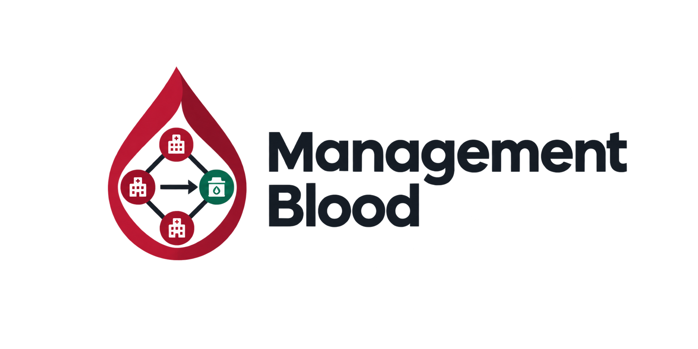

<p align="center"></p>

# Hệ thống DSS điều phối máu giữa bệnh viện và ngân hàng máu

Hệ thống số hỗ trợ **phát hiện nguy cơ thiếu máu** theo nhóm máu, khu vực và thời gian, **xếp hạng cơ sở nguồn** (bệnh viện / ngân hàng máu), và hỗ trợ **theo dõi giao nhận điều chuyển** (xác nhận → xuất → checklist vận chuyển → đối chiếu nhập → audit). Đối tượng: nhân viên bệnh viện, nhân viên ngân hàng máu và quản trị viên điều phối (web admin React).

## Đọc trước

1. [Product.md](Product.md) — PRD / FR  
2. [docs/can-cu-phap-ly.md](docs/can-cu-phap-ly.md) — TT 26 & giới hạn  
3. [docs/thiet-ke-he-thong.md](docs/thiet-ke-he-thong.md) — thiết kế  
4. [docs/ke-hoach-chinh-sua.md](docs/ke-hoach-chinh-sua.md) — giai đoạn  
5. [AGENTS.md](AGENTS.md) — thứ tự đọc cho agent  

---

## Tính năng chính

- **Tài khoản & phân quyền (FR01):** đăng nhập JWT, RBAC 3 vai trò.
- **Cơ sở BV / NHM (FR03′):** địa điểm, loại `hospital` \| `bank`, toạ độ, cờ `allowed_to_supply_others`.
- **Tồn kho máu (FR06):** đơn vị máu, chế phẩm, hạn dùng; nhập **đơn vị mới**, xuất sử dụng / hủy bỏ / hết hạn kèm ghi chú; xét duyệt cách ly; lịch sử theo đơn vị.
- **Điều chuyển lifecycle (FR06b):** đề xuất → xác nhận nguồn → xuất → bàn giao VC (checklist) → đã nhận hàng → đối chiếu nhập → audit; từ chối → cách ly tại nguồn; hủy chỉ trước xuất.
- **Nhu cầu máu (FR07):** yêu cầu theo nhóm máu, chế phẩm, số lượng, BV nhận, ưu tiên; hủy kèm lý do.
- **Matching cơ sở (FR08):** điểm đa tiêu chí, xếp hạng Top-K nguồn được phép cung cấp, khớp chặt nhóm + chế phẩm (DSS — không fulfill ngay).
- **Nhật ký thao tác (FR13):** audit log thao tác nhạy cảm, màn admin `/system/audit`.
- **Cảnh báo (FR09):** thiếu hụt, tồn thấp, hết hạn.
- **Thông báo nội bộ (FR11):** đề xuất / bước transfer / hoàn thành.
- **Báo cáo & KPI (FR12):** tồn kho, nhu cầu, transfer, hiệu quả điều phối.

Vòng nghiệp vụ lõi: **Nhu cầu → Shortage → Matching cơ sở → Đề xuất → Xác nhận → Xuất → Bàn giao VC → Đã nhận hàng → Đối chiếu nhập → Fulfill / Alert / Audit**.

---

## Công nghệ sử dụng

| Thành phần | Công nghệ |
| --- | --- |
| Web Admin | React + Vite + Bootstrap |
| Backend | Python FastAPI (REST API) |
| Database / BaaS | Supabase (PostgreSQL) hoặc SQLite local |

Kiến trúc: `admin-web` gọi **FastAPI**; FastAPI kết nối DB. **Không** đưa `SUPABASE_SERVICE_ROLE_KEY` ra client.

---

## Cấu trúc thư mục

```
Management_Blood/
├── README.md
├── Product.md
├── .env.example
├── admin-web/          # React admin
├── backend/            # FastAPI
├── supabase/           # migrations + bootstrap SQL
├── docs/
└── .cursor/
```

---

## Vai trò người dùng

| Vai trò | Ứng dụng | Nhu cầu chính |
| --- | --- | --- |
| Nhân viên bệnh viện (`staff_hospital`) | Web Admin | Nhu cầu BV, nhận hàng / đối chiếu nhập / từ chối tại đích |
| Nhân viên ngân hàng máu (`staff_bank`) | Web Admin | Kho nguồn: nhập / xuất, xác nhận, xuất điều chuyển, bàn giao VC, xét duyệt cách ly |
| Quản trị / điều phối (`admin`) | Web Admin | Matching, giám sát transfer, users, báo cáo, nhật ký thao tác |

---

## Hướng dẫn cài đặt và chạy

### Yêu cầu

- Git, Node.js 20+, Python 3.11+
- (Tuỳ chọn) Supabase project / CLI

### 1. Clone & env

```bash
git clone <URL_REPOSITORY>
cd Management_Blood
cp .env.example .env
```

### 2. Database

**Local (mặc định):** SQLite `sqlite:///./management_blood.db` — backend tự tạo bảng + seed khi khởi động.

> Khi khởi động, backend tự thêm các cột còn thiếu vào SQLite cũ (`upgrade_sqlite_schema`). Nếu dữ liệu demo vẫn lỗi, xóa file SQLite trong `backend/` rồi khởi động lại để seed lại.

**Supabase:** dán [`supabase/sql_editor_bootstrap.sql`](supabase/sql_editor_bootstrap.sql) vào SQL Editor → Run; đặt `DATABASE_URL` trong `.env`. DB đã có từ trước: chạy thêm migration [`supabase/migrations/20261006000000_tt26_strict_compliance.sql`](supabase/migrations/20261006000000_tt26_strict_compliance.sql).

### 3. Backend

`.env` đặt ở **gốc repo** (backend tự đọc `../.env`). API docs: `http://localhost:8000/docs`.

**Windows (PowerShell) — cài lần đầu:**

```powershell
cd backend
py -3 -m venv .venv
.\.venv\Scripts\python.exe -m pip install -r requirements.txt
```

**Windows — chạy hằng ngày** (không cần `Activate.ps1`, tránh lỗi ExecutionPolicy):

```powershell
cd backend
.\.venv\Scripts\python.exe -m uvicorn app.main:app --reload --host 0.0.0.0 --port 8000
```

Hoặc từ gốc repo: `.\scripts\dev-backend.ps1` (tự tạo `.venv` nếu thiếu, giải phóng port 8000 rồi chạy).

**macOS / Linux:**

```bash
cd backend
python3 -m venv .venv
.venv/bin/pip install -r requirements.txt
.venv/bin/python -m uvicorn app.main:app --reload --host 0.0.0.0 --port 8000
```

**Tài khoản demo (synthetic):**

| Email | Mật khẩu | Role |
| --- | --- | --- |
| tanhoanganh2006a@gmail.com | Admin@123 | admin |
| hospital@bloodbank.gov.vn | Hospital@123 | staff_hospital |
| bank@bloodbank.gov.vn | Bank@123 | staff_bank |

**Kiểm thử backend (pytest):**

```powershell
cd backend
.\.venv\Scripts\python.exe -m pip install -r requirements-dev.txt
.\.venv\Scripts\python.exe -m pytest -q
```

Checklist kiểm thử thủ công ba vai trò: [docs/checklist-kiem-thu-transfer.md](docs/checklist-kiem-thu-transfer.md).

### 4. Web Admin

```bash
cd admin-web
npm install
npm run dev
```

Hoặc từ gốc repo (Windows): `.\scripts\dev-web.ps1`.

Mở **`http://localhost:5173`** (Vite khóa host/port này) · `VITE_API_BASE_URL=http://localhost:8000/api/v1`.

**Lỗi `Port 5173 is already in use`:** một tiến trình Vite/uvicorn cũ vẫn chạy ngầm (thường do đóng terminal mà tiến trình con không tắt). Chạy `.\scripts\stop-dev.ps1` từ gốc repo để giải phóng port 5173 và 8000, rồi chạy lại. Không đổi port vì origin Google OAuth đã đăng ký cố định `http://localhost:5173`.

**Google Sign-In — lỗi `400: origin_mismatch`:** trong [Google Cloud Console → Credentials](https://console.cloud.google.com/apis/credentials), mở OAuth Client **Web** trùng `GOOGLE_CLIENT_ID`, thêm vào **Authorized JavaScript origins** và **Authorized redirect URIs**:

```
http://localhost:5173
http://127.0.0.1:5173
```

Save → đợi 1–5 phút → mở lại `http://localhost:5173` (không dùng host/port khác).

---

## Cấu hình biến môi trường

Xem [`.env.example`](.env.example): `DATABASE_URL`, `JWT_SECRET`, `CORS_ORIGINS`, `VITE_API_BASE_URL`, …

---

## Lưu ý quan trọng

- Đây là hệ thống **hỗ trợ quyết định**, không thay thế chuyên môn y tế, hợp đồng cung cấp máu, hay thẩm quyền cấp phép.
- Không tự động điều chuyển máu “có hiệu lực pháp lý”; chỉ hỗ trợ phiếu/yêu cầu và theo dõi giao nhận (tinh thần TT 26/2013 Điều 39, 20, 40, 61).
- Matching và cảnh báo cần **giải thích được**; có MatchingLog. Công thức Shortage/Score là heuristic nghiên cứu — không gắn nhãn “theo BYT”.
- Novelty: shortage không gian–thời gian + matching đa tiêu chí **cơ sở nguồn**.

---

## Giấy phép

Đang cập nhật theo quy định của nhóm / cơ sở đào tạo.
