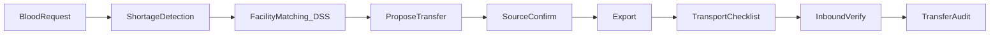

# Thiết kế hệ thống — Management Blood (DSS Điều phối BV ↔ NHM)

**Phiên bản:** 2.1  
**Ngày:** 2026-09-24  
**Phạm vi:** MVP theo [Product.md](../Product.md) v2.1  
**Căn cứ:** [can-cu-phap-ly.md](can-cu-phap-ly.md)  
**UI tham chiếu:** Figma admin (Management Blood — Hệ thống DSS Điều phối máu)

---

## 1. Mục tiêu

Hệ thống **hỗ trợ quyết định (DSS)** phát hiện thiếu máu theo nhóm máu – địa điểm – thời gian, xếp hạng **cơ sở nguồn**, và khép vòng giao nhận:

nhu cầu → kho → shortage → matching cơ sở → **đề xuất** → **xác nhận nguồn** → **xuất** → **VC checklist** → **đối chiếu nhập** → fulfill / alert / audit.

Kết quả thuật toán **chỉ hỗ trợ vận hành**, không thay quyết định y tế hay thẩm quyền pháp lý.  
**Không** huy động người hiến trong phạm vi MVP.  
**Không** atomic transfer (teleport + fulfill một bước).

---

## 2. Kiến trúc

```text
admin-web (React + Vite + Bootstrap)
        │  JWT REST
        ▼
backend (FastAPI /api/v1)  ── facility matching / shortage / transfer lifecycle
        │
        ▼
PostgreSQL (Supabase)  hoặc  SQLite (local prototype)
```

| Lớp | Công nghệ | Ghi chú |
| --- | --- | --- |
| Admin | `admin-web/` React + Vite + Bootstrap | Chỉ gọi FastAPI |
| API | `backend/` FastAPI | JWT + RBAC |
| DB | `supabase/migrations` + SQLite local | Service role chỉ trên server |

**Nguyên tắc:** không đưa `SUPABASE_SERVICE_ROLE_KEY` ra client; không nhúng engine matching trên frontend.

---

## 3. Vai trò (RBAC)

| Role | Ứng dụng | Phạm vi |
| --- | --- | --- |
| `staff_hospital` | Admin | Nhu cầu BV mình; inbound verify tại đích; xem kho hạn chế |
| `staff_bank` | Admin | Tồn kho nguồn; confirm / export / transit checklist |
| `admin` | Admin | Matching, đề xuất transfer, giám sát, users, báo cáo; prototype: leadership confirm khi chưa HĐ |

### Ma trận quyền MVP (transfer)

| Bước | staff_hospital | staff_bank | admin |
| --- | --- | --- | --- |
| Matching / đề xuất (`proposed`) | không | xem | chạy + tạo đề xuất |
| Source confirm | không (trừ staff thuộc nguồn) | nguồn của mình | có |
| Leadership confirm (khi không HĐ) | không | nguồn (prototype) | có |
| Export / transit checklist | không | nguồn | có |
| Inbound verify | đích của mình | không | có |
| Reject / cancel | theo bước đang mở | theo bước đang mở | có |

---

## 4. Ánh xạ Figma → route → FR

| Màn | Route | FR |
| --- | --- | --- |
| Đăng nhập | `/login` | FR01 |
| Tổng quan | `/` | FR09, FR12 |
| Cảnh báo | `/alerts` | FR09 |
| Matching cơ sở | `/matching` | FR08 |
| Điều chuyển | `/transfers` | FR06b |
| Thông báo nội bộ | `/notifications` | FR11 |
| Kho máu | `/inventory` | FR06 |
| Nhu cầu | `/demands` | FR07 |
| Cơ sở (BV / NHM) | `/centers` | FR03′ |
| Báo cáo KPI | `/reports` | FR12 |
| User & RBAC | `/system/users` | FR01 |

Nút **Khẩn cấp** trên header → `/alerts?severity=critical`.

---

## 5. Mô hình dữ liệu

### 5.1. Thực thể

| Bảng | Mục đích |
| --- | --- |
| `users` | Tài khoản + role + `center_id` scope |
| `donation_centers` | Cơ sở `hospital` \| `bank`; `allowed_to_supply_others`; `has_supply_contract` |
| `blood_units` | Đơn vị máu / chế phẩm (`ready`/`reserved`/`transferred`/…) |
| `inventory_transactions` | `in` / `out` (+ `blood_request_id`, `transfer_id`) |
| `blood_requests` | Nhu cầu máu |
| `blood_transfers` | Lifecycle điều chuyển + checklist JSON |
| `transfer_events` | Audit chuyển trạng thái |
| `alerts` | Cảnh báo shortage / hạn / tồn thấp |
| `notifications` | Thông báo nội bộ staff |
| `matching_logs` | Audit chạy matching Top-K cơ sở |

### 5.2. State machine BloodTransfer

```text
proposed → source_confirmed → exported → in_transit → inbound_pending → received
                                                                      ↘ rejected
any open → cancelled
```

| Status | Ý nghĩa | Unit |
| --- | --- | --- |
| `proposed` | Đề xuất từ matching / thủ công | còn `ready` tại nguồn |
| `source_confirmed` | Nguồn chấp nhận | `reserved` |
| `exported` | Xuất kho nguồn | `transferred` |
| `in_transit` | Đang VC + checklist Điều 20 | `transferred` |
| `inbound_pending` | Chờ đối chiếu nhập | `transferred` |
| `received` | Đối chiếu đạt (Điều 40) | `ready` tại đích; fulfill |
| `rejected` / `cancelled` | Từ chối / hủy | trả `ready` nguồn nếu còn hợp lệ |

### 5.3. Công thức DSS (prototype — copy từ Product §5)

Không gắn nhãn BYT. Ngưỡng: `COVERAGE_WARN=0.85`, `COVERAGE_CRITICAL=0.40` — cấu hình.

Matching chỉ xét nguồn `allowed_to_supply_others = true`.

---

## 6. API contract (tóm tắt)

Prefix: `/api/v1` · Auth: `Authorization: Bearer <JWT>`

| Nhóm | Method / Path |
| --- | --- |
| Auth | `POST /auth/login`, `GET /auth/me` |
| Dashboard | `GET /dashboard/summary` |
| Centers | `GET /centers`, `PATCH /centers/{id}` (admin — cờ cung cấp) |
| Inventory | `GET /inventory/units`, `POST /inventory/transactions` (`in`/`out` only) |
| Transfers | `GET/POST /transfers`, `POST /transfers/{id}/confirm`, `/export`, `/transit`, `/receive`, `/reject`, `/cancel` |
| Demands | `GET/POST /demands`, `PATCH /demands/{id}` |
| Alerts | `GET /alerts`, `PATCH /alerts/{id}` |
| Matching | `POST /matching/run`, `GET /matching/logs` |
| Notifications | `GET /notifications`, `POST /notifications` |
| Reports | `GET /reports/kpis` |
| Users | `GET/POST /users`, `PATCH /users/{id}` (admin) |

**Cấm:** `POST /inventory/transactions` với `type=transfer` (atomic) — trả 400 hướng dẫn dùng `/transfers`.

### Checklist vận chuyển (MVP — ghi nhận, không IoT)

Theo tinh thần Điều 20: dải nhiệt theo loại chế phẩm; đá không tiếp xúc trực tiếp túi máu.

### Checklist nhập kho (MVP)

Theo tinh thần Điều 40: đối chiếu bao gói, nhãn, điều kiện bảo quản/VC; ghi chú bất thường.

---

## 7. Luồng nghiệp vụ lõi



---

## 8. MVP vs Phase 2+

| Trong MVP | Phase 2+ |
| --- | --- |
| JWT + RBAC 3 role, synthetic data | 2FA / PKI |
| Shortage / Coverage / Facility matching + log | Tối ưu trọng số |
| Checklist VC / nhập (ghi nhận) | IoT cold chain realtime |
| Thông báo stub nội bộ | SMS / Zalo thật |
| Lifecycle transfer + audit events | Map đủ Phụ lục 8; sync NHM QG |
| Báo cáo KPI lịch sử | ML forecasting |

---

## 9. Bảo mật & riêng tư

- Thu thập tối thiểu; RBAC trên mọi endpoint nghiệp vụ.
- Không commit `.env`; dùng `.env.example`.
- Dữ liệu prototype: **synthetic**.
- Audit transfer_events cho thao tác giao nhận nhạy cảm.

---

## 10. Cách chạy prototype

Xem [README.md](../README.md).

---

## 11. Lịch sử

| Phiên bản | Ngày | Mô tả |
| --- | --- | --- |
| 1.0 | 2026-09-17 | Khởi tạo MVP donor-centric |
| 2.0 | 2026-09-17 | Pivot BV ↔ NHM; bỏ donor/appointments/donations |
| 2.1 | 2026-09-24 | Lifecycle TT26-min; API transfers; cờ cung cấp; bỏ atomic transfer |
