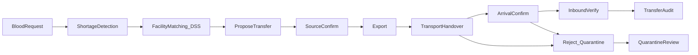

# Thiết kế hệ thống — Management Blood (DSS Điều phối BV ↔ NHM)

**Phiên bản:** 2.3  
**Ngày:** 2026-10-06  
**Phạm vi:** MVP theo [Product.md](../Product.md) v2.3  
**Căn cứ:** [can-cu-phap-ly.md](can-cu-phap-ly.md)  
**UI tham chiếu:** Figma admin (Management Blood — Hệ thống DSS Điều phối máu)

---

## 1. Mục tiêu

Hệ thống **hỗ trợ quyết định (DSS)** phát hiện thiếu máu theo nhóm máu – địa điểm – thời gian, xếp hạng **cơ sở nguồn**, và khép vòng giao nhận:

nhu cầu → kho → shortage → matching cơ sở → **đề xuất** → **xác nhận nguồn** → **xuất** → **bàn giao VC (checklist)** → **đã nhận hàng** → **đối chiếu nhập** → fulfill / alert / audit. Từ chối → đơn vị **cách ly** tại nguồn → xét duyệt.

Kết quả thuật toán **chỉ hỗ trợ vận hành**, không thay quyết định y tế hay thẩm quyền pháp lý.  
**Không** atomic transfer (teleport + fulfill một bước).

---

## 2. Kiến trúc

```text
admin-web (React + Vite + Bootstrap)
        │  JWT REST
        ▼
backend (FastAPI /api/v1)  ── facility matching / shortage / transfer lifecycle
        │
        ▼
PostgreSQL (Supabase)  hoặc  SQLite (local prototype)
```

| Lớp | Công nghệ | Ghi chú |
| --- | --- | --- |
| Admin | `admin-web/` React + Vite + Bootstrap | Chỉ gọi FastAPI |
| API | `backend/` FastAPI | JWT + RBAC |
| DB | `supabase/migrations` + SQLite local | Service role chỉ trên server |

**Nguyên tắc:** không đưa `SUPABASE_SERVICE_ROLE_KEY` ra client; không nhúng engine matching trên frontend.

---

## 3. Vai trò (RBAC)

| Role | Ứng dụng | Phạm vi |
| --- | --- | --- |
| `staff_hospital` | Admin | Nhu cầu BV mình (tạo / hủy); nhận hàng + đối chiếu / từ chối tại đích; chỉ xem kho cơ sở mình; bước nguồn khi BV mình là nguồn |
| `staff_bank` | Admin | Tồn kho cơ sở mình: nhập mới / xuất / xét duyệt cách ly; đề xuất từ kho mình; confirm / export / bàn giao VC |
| `admin` | Admin | Matching, đề xuất, mọi bước lifecycle, users, cấu hình cơ sở, nhật ký thao tác; prototype: leadership confirm khi chưa HĐ |

Mọi NV phải gắn `center_id` hợp lệ (backend chặn khi tạo user). Mọi endpoint chi tiết điều chuyển trả **403** cho cơ sở không phải nguồn/đích (trừ admin).

### Ma trận quyền MVP (transfer)

"Nguồn" / "đích" = NV có `center_id` trùng `source_center_id` / `dest_center_id`.

| Bước | NV nguồn | NV đích | admin |
| --- | --- | --- | --- |
| Đề xuất (`proposed`) | chỉ `staff_bank`, từ kho mình | không | có (màn Matching) |
| Leadership confirm (khi không HĐ, kèm lý do) | có | không | có |
| Source confirm / Export / Bàn giao VC | có | không | có |
| Đã nhận hàng / Đối chiếu nhập | không | có | có |
| Từ chối (`in_transit`, `inbound_pending`) | **không** | có | có |
| Hủy (`proposed`, `source_confirmed`) | có | không | có |

### Ma trận quyền kho & nhu cầu

| Thao tác | staff_hospital | staff_bank | admin |
| --- | --- | --- | --- |
| Xem kho | cơ sở mình | tất cả (scope theo bộ lọc) | tất cả |
| Nhập đơn vị mới / Xuất | không | cơ sở mình | chọn cơ sở |
| Xét duyệt cách ly | cơ sở mình | cơ sở mình | có |
| Tạo nhu cầu | cơ sở mình (cố định) | không | chọn cơ sở |
| Hủy nhu cầu | cơ sở mình | không | có |
| Chạy matching | không | không | có |
| Nhật ký thao tác `/audit-logs` | không | không | có |

---

## 4. Ánh xạ Figma → route → FR

| Màn | Route | FR |
| --- | --- | --- |
| Đăng nhập | `/login` | FR01 |
| Tổng quan | `/` | FR09, FR12 |
| Cảnh báo | `/alerts` | FR09 |
| Matching cơ sở | `/matching` | FR08 |
| Điều chuyển (danh sách, lọc `?filter=mine\|open\|all&request=`) | `/transfers` | FR06b |
| Chi tiết điều chuyển (một CTA / bước, timeline audit) | `/transfers/:id` | FR06b |
| Thông báo nội bộ | `/notifications` | FR11 |
| Kho máu | `/inventory` | FR06 |
| Nhu cầu | `/demands` | FR07 |
| Cơ sở (BV / NHM) | `/centers` | FR03′ |
| Báo cáo KPI | `/reports` | FR12 |
| User & RBAC | `/system/users` | FR01 |
| Nhật ký thao tác (admin) | `/system/audit` | FR13 |

Nút **Cảnh báo nghiêm trọng** trên header → `/alerts?severity=critical`.

---

## 5. Mô hình dữ liệu

### 5.1. Thực thể

| Bảng | Mục đích |
| --- | --- |
| `users` | Tài khoản + role + `center_id` scope |
| `donation_centers` | Cơ sở `hospital` \| `bank`; `allowed_to_supply_others`; `has_supply_contract` |
| `blood_units` | Đơn vị máu / chế phẩm — status: `ready`, `critical`, `reserved`, `transferred`, `used`, `expired`, `quarantine`, `discarded` |
| `inventory_transactions` | `in` / `out` + `reason` (`receipt`, `issued`, `discarded`, `expired`, `transfer_out`, `transfer_in`, `return_quarantine`) (+ `blood_request_id`, `transfer_id`) |
| `blood_requests` | Nhu cầu máu (+ `created_by`, `cancel_reason`) |
| `blood_transfers` | Lifecycle điều chuyển + checklist JSON; `leadership_confirmed_by/_at`, `leadership_reason`, `handed_over_by`, `carrier_name`, `arrived_at`, `received_by`, `cancel_reason` |
| `transfer_events` | Audit chuyển trạng thái (actor, from/to, note, thời điểm) |
| `audit_logs` | Audit thao tác nhạy cảm: `actor_id`, `action`, `entity`, `entity_id`, `details` JSON, `created_at` |
| `alerts` | Cảnh báo shortage / hạn / tồn thấp |
| `notifications` | Thông báo nội bộ staff |
| `matching_logs` | Audit chạy matching Top-K cơ sở |

Migration Postgres: `supabase/migrations/20261006000000_tt26_strict_compliance.sql`. SQLite local: `upgrade_sqlite_schema()` tự thêm cột thiếu khi khởi động.

Action `audit_logs` hiện có: `inventory.view`, `inventory.receive`, `inventory.out`, `inventory.quarantine_review`, `matching.run`, `report.view`, `demand.create`, `demand.cancel`, `center.update`, `user.create`, `user.update`.

### 5.2. State machine BloodTransfer

```text
proposed → source_confirmed → exported → in_transit → inbound_pending → received
                                          │               │
                                          └──── rejected ◄┘   (đích; unit → quarantine tại nguồn)
proposed | source_confirmed → cancelled                      (nguồn / admin; unit → ready)
```

| Status | Ý nghĩa | Unit |
| --- | --- | --- |
| `proposed` | Đề xuất từ matching / thủ công | còn `ready` tại nguồn (bị loại khỏi matching vì thuộc điều chuyển mở) |
| `source_confirmed` | Nguồn chấp nhận | `reserved` |
| `exported` | Xuất kho nguồn (txn `transfer_out`) | `transferred` |
| `in_transit` | Đã bàn giao VC + checklist Điều 20 | `transferred` |
| `inbound_pending` | Đích xác nhận đã nhận hàng, chờ đối chiếu | `transferred` |
| `received` | Đối chiếu đạt (Điều 40) (txn `transfer_in`) | `ready` tại đích; `qty_fulfilled + 1` |
| `rejected` | Đích từ chối (txn `return_quarantine`) | `quarantine` tại nguồn → xét duyệt `ready` / `discarded` |
| `cancelled` | Hủy trước xuất | `ready` (hoặc `expired` nếu quá hạn) |

### 5.2b. Kiểm tra bắt buộc của backend

| Bước | Kiểm tra |
| --- | --- |
| Đề xuất | Nguồn `allowed_to_supply_others`; nhu cầu `open`/`matching`; đích = cơ sở nhu cầu; nguồn ≠ đích; khớp nhóm máu + chế phẩm; đơn vị sẵn sàng + còn hạn; không thuộc điều chuyển mở (409); còn số lượng thiếu (`qty_needed − qty_fulfilled − open > 0`); không HĐ → `leadership_confirm` + lý do ≥ 3 |
| Xác nhận | Còn quyền cung cấp; đơn vị sẵn sàng tại nguồn, còn hạn; leadership nếu chưa có |
| Xuất | Đơn vị `reserved` tại nguồn, còn hạn |
| Bàn giao VC | `temperature_band` = dải theo chế phẩm (PRBC/WB `1_to_10C`; PLT/WBC `20_to_24C`; FFP/CRYO `le_minus_18C`); `measured_temp_c` (nếu có) trong dải; đá không tiếp xúc; phương tiện; `carrier_name` ≥ 2 |
| Đã nhận hàng | Chỉ đích / admin |
| Đối chiếu nhập | Đủ 3 mục checklist; đơn vị `transferred`, còn hạn |
| Từ chối | Chỉ đích / admin; lý do ≥ 3; lưu mục không đạt |
| Hủy | Chỉ `proposed`/`source_confirmed`; lý do ≥ 3 |

### 5.3. Công thức DSS (prototype — copy từ Product §5)

Không gắn nhãn BYT. Ngưỡng: `COVERAGE_WARN=0.85`, `COVERAGE_CRITICAL=0.40` — cấu hình. Màu ma trận tồn kho trên UI lấy từ `GET /inventory/coverage` (cùng ngưỡng), không dùng ngưỡng riêng trên frontend.

Matching chỉ xét nguồn `allowed_to_supply_others = true`; tồn khả dụng = đơn vị `ready`/`critical`, còn hạn, đúng chế phẩm, chưa thuộc điều chuyển mở.

---

## 6. API contract (tóm tắt)

Prefix: `/api/v1` · Auth: `Authorization: Bearer <JWT>`

| Nhóm | Method / Path |
| --- | --- |
| Auth | `POST /auth/login`, `GET /auth/me` |
| Dashboard | `GET /dashboard/summary` |
| Centers | `GET /centers`, `PATCH /centers/{id}` (admin — cờ cung cấp) |
| Inventory | `GET /inventory/units` (audit `inventory.view`; staff_hospital chỉ cơ sở mình), `GET /inventory/units/{id}/history`, `GET /inventory/coverage`, `POST /inventory/transactions` (`in` = đơn vị mới; `out` = `issued`/`discarded`/`expired` + ghi chú), `POST /inventory/units/{id}/quarantine-review` (`release`/`discard` + lý do) |
| Transfers | `GET/POST /transfers`, `GET /transfers/{id}`, `POST /transfers/{id}/confirm`, `/export`, `/transit`, `/arrive`, `/receive`, `/reject`, `/cancel` |
| Demands | `GET/POST /demands`, `PATCH /demands/{id}` (chỉ `{status: "cancelled", cancel_reason}`) |
| Alerts | `GET /alerts`, `PATCH /alerts/{id}` |
| Matching | `POST /matching/run` (trả `component_max`; audit `matching.run`), `GET /matching/units?request_id&center_id`, `GET /matching/logs` |
| Notifications | `GET /notifications`, `POST /notifications` |
| Reports | `GET /reports/kpis` (audit `report.view`) |
| Users | `GET/POST /users`, `PATCH /users/{id}` (admin) |
| Audit | `GET /audit-logs?action=` (admin) |

**Cấm:** `POST /inventory/transactions` với `type=transfer` (atomic) — 400; `type=in` kèm `unit_id` — 400; barcode trùng — 409. `PATCH /demands` không nhận `qty_fulfilled`.

### Checklist vận chuyển (MVP — ghi nhận, không IoT)

`POST /transfers/{id}/transit`: `temperature_band` (phải bằng dải theo chế phẩm), `measured_temp_c` (tùy chọn, trong dải), `ice_not_direct_contact=true`, `vehicle_ok=true`, `carrier_name` (bắt buộc). Kết thúc ở `in_transit`.

### Checklist nhập kho (MVP)

`POST /transfers/{id}/receive`: `packaging_ok`, `label_ok`, `transport_condition_ok` đều `true`; `anomaly_note` (có → thông báo hai cơ sở). `POST /transfers/{id}/reject`: `reason` + các mục đạt/không đạt; checklist lưu `result: "rejected"`.

### Audit log

`audit_logs.action`: `inventory.view`, `inventory.receive`, `inventory.out`, `inventory.quarantine_review`, `report.view`, `matching.run`, `demand.create`, `demand.cancel`, `center.update`, `user.create`, `user.update`. Chuyển trạng thái điều chuyển ghi ở `transfer_events`.

---

## 7. Luồng nghiệp vụ lõi



---

## 8. MVP vs Phase 2+

| Trong MVP | Phase 2+ |
| --- | --- |
| JWT + RBAC 3 role, synthetic data | 2FA / PKI |
| Shortage / Coverage / Facility matching + log | Tối ưu trọng số |
| Checklist VC / nhập (ghi nhận) | IoT cold chain realtime |
| Thông báo stub nội bộ | SMS / Zalo thật |
| Lifecycle transfer + audit events | Map đủ Phụ lục 8; sync NHM QG |
| Báo cáo KPI lịch sử | ML forecasting |

---

## 9. Bảo mật & riêng tư

- Thu thập tối thiểu; RBAC trên mọi endpoint nghiệp vụ.
- Không commit `.env`; dùng `.env.example`.
- Dữ liệu prototype: **synthetic**.
- Audit `transfer_events` cho mọi chuyển trạng thái giao nhận; `audit_logs` cho xem kho, báo cáo, matching, nhập/xuất, cách ly, nhu cầu, cấu hình cơ sở, user.
- Trang đăng nhập không điền sẵn tài khoản; bản nháp form không lưu mật khẩu.
- Kiểm thử: `backend/tests` (pytest) — xem [checklist-kiem-thu-transfer.md](checklist-kiem-thu-transfer.md).

---

## 10. Cách chạy prototype

Xem [README.md](../README.md).

---

## 11. Lịch sử

| Phiên bản | Ngày | Mô tả |
| --- | --- | --- |
| 1.0 | 2026-09-17 | Khởi tạo MVP |
| 2.0 | 2026-09-17 | Pivot BV ↔ NHM |
| 2.1 | 2026-09-24 | Lifecycle TT26-min; API transfers; cờ cung cấp; bỏ atomic transfer |
| 2.3 | 2026-10-06 | P2d: `/arrive`, cách ly + xét duyệt, hủy chỉ trước xuất, từ chối chỉ đích; ma trận quyền chi tiết; `audit_logs`; API coverage / history / matching units / audit-logs; route `/transfers/:id`, `/system/audit` |
